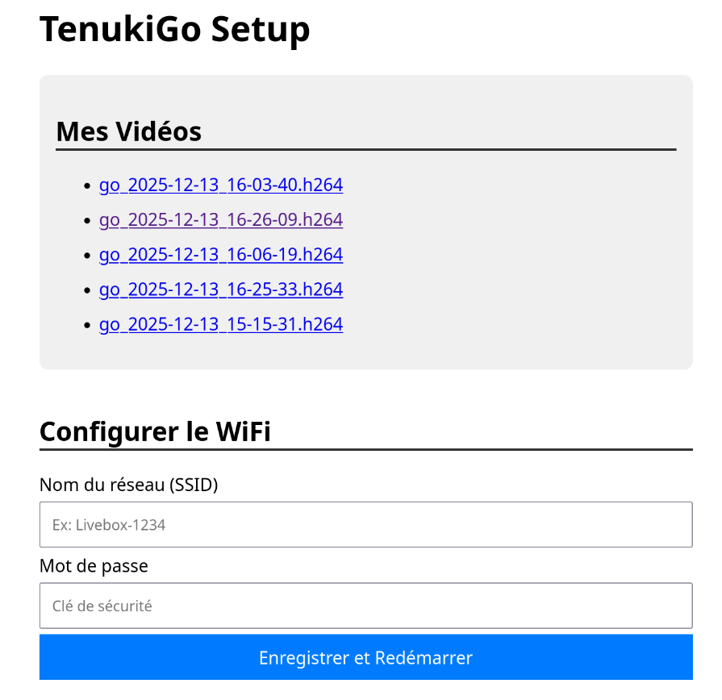

# TenukiGo-Pi

TenukiGo-Pi is a fully containerized IoT system for recording and analyzing Go (Weiqi/Baduk) games on a Raspberry Pi. It leverages Computer Vision (YOLO + CNN) to digitize real-world games into SGF format automatically.


---

## Table of Contents

1. [Architecture](#architecture)
2. [Hardware Requirements](#hardware-requirements)
3. [Installation & Deployment](#installation--deployment)
4. [Usage](#usage)
5. [Ansible Infrastructure](#ansible-infrastructure)
6. [Project Structure](#project-structure)
7. [Developer Guide](#developer-guide)

---

## Architecture

The project follows a strict separation of concerns:

1.  **Infrastructure (Host - Ansible)**:
    *   System configuration (OS hardening, Docker Engine).
    *   Network Management (NetworkManager-based switching between Client and AP modes).
    *   Hardware Interface (Python daemon managing GPIO buttons & LEDs).
    *   Captive Portal for easy Wi-Fi configuration.

2.  **Application (Container - Docker)**:
    *   Video Capture (`rpicam-vid` optimized).
    *   Game Logic (`sente` library).
    *   Computer Vision (YOLOv8 for board detection + TensorFlow Lite for stone classification).
    *   Encapsulated in a `tenukigo-app` image based on `python:3.10-slim`.

---

## Hardware Requirements

*   **Raspberry Pi 3B+** (or newer).
*   **Raspberry Pi Camera Module 2** (or newer).
*   **Physical Interface**:
    *   3 Push Buttons: **Green** (Start/Stop), **Red** (Power), **Blue** (Wi-Fi/AP Toggle).
    *   Status LEDs (integrated or external).

### GPIO Pin Configuration

| Component         | GPIO Pin | Function                           |
|-------------------|----------|------------------------------------|
| LED RGB Green     | 17       | Client WiFi mode indicator         |
| LED RGB Blue      | 27       | AP WiFi mode indicator             |
| Button RGB        | 22       | Toggle WiFi mode (Client ↔ AP)     |
| LED Green Simple  | 5        | Capture/Streaming active indicator |
| LED Red Simple    | 6        | Error/Stop indicator               |
| Button Green      | 23       | Start capture + streaming          |
| Button Red        | 24       | Stop capture + streaming           |

---

## Installation & Deployment

### Prerequisites (Control Machine)

*   User with SSH access to the Raspberry Pi (i.e. on the same network).
*   `ansible` installed locally.
*   `podman` or `docker` (optional, for rebuilding the application image).

### Deployment Steps

We provide a unified deployment script to handle discovery and provisioning.

**Step 1: Rebuild the Application Image** (If code changes were made)

```bash
cd app
podman build --no-cache --platform linux/arm64 -t tenukigo-app:latest .
cd ..
```

**Step 2: Deploy to Raspberry Pi**

Run the deployment wrapper. It automatically discovers the Pi on your network (via mDNS) and triggers the Ansible playbook.

```bash
./deploy.sh [hostname]
```

*Example: `./deploy.sh tenukigo-pi`*

The script will prompt for the `BECOME` password (the `sudo` password for the remote user on the Pi).

### What the Deployment Does

1. **Discovery** (`tools/find_pi.sh`): Resolves the Pi's IP via mDNS and updates `ansible/inventory.ini`.
2. **Provisioning** (`ansible/playbook.yml`): Runs all Ansible roles to configure the system, deploy scripts, and start services.

---

## Usage

### Physical Interface

*   **Green Button**: 
    *   *Press*: Start recording/analysis session OR live streaming depending on the connection.
*   **Blue Button (Wi-Fi)**: 
    *   *Press*: Toggle between **Client Mode** (Green LED) and **Access Point Mode** (Blue LED).
    *   *AP Mode*: Connect to Wi-Fi `TenukiGo-Pi` (Password: `gocamera-123456`). A captive portal will open to configure your home Wi-Fi credentials.
*   **Red Button**: Shuts down the device when long pressed, or stops the capture/streaming process when short pressed.

### LED Indicators

| LED              | State       | Meaning                        |
|------------------|-------------|--------------------------------|
| RGB Green ON     | Solid       | Connected to WiFi (Client Mode)|
| RGB Blue ON      | Solid       | Access Point Mode active       |
| Green Simple ON  | Solid       | Capture/Streaming in progress  |
| Red Simple ON    | Brief flash | Process stopped                |
| Any LED Blinking | Blinking    | Operation in progress          |

### Retrieving Games

Generated `.sgf` files are stored in `~/output_sgf` on the Pi.
You can retrieve them via:

*   **SCP**: `scp pi@tenukigo-pi.local:~/output_sgf/*.sgf ./`
*   **HTTP Server** (in AP mode): Connect to the captive portal and browse files.



---

## Ansible Infrastructure

### Why Jinja2 (.j2) Templates?

Ansible uses **Jinja2 templates** (`.j2` files) to generate configuration files dynamically. This approach provides several key benefits:

1. **Dynamic Configuration**: Templates can inject variables (from `group_vars/all.yml`) at deployment time, ensuring paths, usernames, and settings adapt to each environment.
2. **Consistency**: A single template generates identical configurations across multiple devices, reducing manual errors.
3. **Version Control**: Templates are text files that can be tracked in Git, unlike binary artifacts.
4. **Separation of Concerns**: Configuration logic stays in Ansible, while the generated scripts remain simple and focused.

**Example**: The `record_game.sh.j2` template uses variables like `{{ videos_dir }}` and `{{ sgf_dir }}` which are resolved from `group_vars/all.yml` during deployment.

### Global Variables

Defined in `ansible/group_vars/all.yml`:

```yaml
project_root: "/home/{{ ansible_user }}"
scripts_dir: "{{ project_root }}/scripts"
videos_dir: "{{ project_root }}/go_videos"
sgf_dir: "{{ project_root }}/output_sgf"
docker_container_name: "tenukigo-app"
```

### Ansible Roles and Script Locations

#### `common/` - Base System Setup

*   **Tasks**: `tasks/main.yml`, `tasks/autologin.yml`
*   **Handlers**: `handlers/main.yml`
*   **Purpose**: Basic OS configuration, package installation, auto-login setup.

---

#### `buttons/` - GPIO Controller

*   **Files**: `files/gpio_controller.py` — Main Python daemon managing all buttons and LEDs
*   **Templates**: `templates/gpio-controller.service.j2` — Systemd service unit
*   **Purpose**: Listens for button presses and triggers capture/streaming/WiFi toggle.

| Template                       | Deployed To                        | Purpose                          |
|--------------------------------|------------------------------------|----------------------------------|
| `gpio-controller.service.j2`   | `/etc/systemd/system/`             | Systemd service for GPIO daemon  |

---

#### `camera/` - Video Capture

*   **Templates**: `templates/record_game.sh.j2`
*   **Purpose**: Script to start video recording with `rpicam-vid` and trigger analysis.

| Template              | Deployed To                 | Purpose                           |
|-----------------------|-----------------------------|-----------------------------------|
| `record_game.sh.j2`   | `~/scripts/record_game.sh`  | Video capture and SGF generation  |

---

#### `network/` - WiFi & Streaming

*   **Templates**: 6 total
*   **Files**: `files/captive-portal-redirect.html` — Basic redirect page
*   **Purpose**: WiFi mode switching, RTMP streaming, captive portal.

| Template                    | Deployed To                        | Purpose                              |
|-----------------------------|------------------------------------|--------------------------------------|
| `ap_mode_enable.sh.j2`      | `~/scripts/ap_mode_enable.sh`      | Enable Access Point mode             |
| `client_mode_enable.sh.j2`  | `~/scripts/client_mode_enable.sh`  | Enable Client (WiFi) mode            |
| `hostapd.conf.j2`           | `/etc/hostapd/hostapd.conf`        | Access Point configuration           |
| `dnsmasq.conf.j2`           | `/etc/dnsmasq.d/tenukigo.conf`     | DHCP/DNS for AP mode                 |
| `stream_video.sh.j2`        | `~/scripts/stream_video.sh`        | RTMP streaming to external server    |
| `wifi_config_server.py.j2`  | `~/scripts/wifi_config_server.py`  | Captive portal web server            |

---

#### `docker/` - Container Management

*   **Tasks**: `tasks/main.yml`
*   **Purpose**: Loads Docker image, manages container lifecycle.

---

## Project Structure

```text
.
├── ansible/                    # Infrastructure as Code
│   ├── ansible.cfg             # Ansible configuration
│   ├── inventory.ini           # Target host (auto-updated by find_pi.sh)
│   ├── playbook.yml            # Main provisioning playbook
│   ├── group_vars/
│   │   └── all.yml             # Global variables for templates
│   └── roles/
│       ├── buttons/            # GPIO controller daemon
│       │   ├── files/gpio_controller.py
│       │   └── templates/gpio-controller.service.j2
│       ├── camera/             # Video capture scripts
│       │   └── templates/record_game.sh.j2
│       ├── common/             # Base OS setup
│       ├── docker/             # Container lifecycle
│       └── network/            # WiFi & streaming
│           ├── files/captive-portal-redirect.html
│           └── templates/
│               ├── ap_mode_enable.sh.j2
│               ├── client_mode_enable.sh.j2
│               ├── dnsmasq.conf.j2
│               ├── hostapd.conf.j2
│               ├── stream_video.sh.j2
│               └── wifi_config_server.py.j2
├── app/                        # Application Source Code
│   ├── Dockerfile              # Application image definition
│   ├── main.py                 # Analysis entry point
│   ├── src/                    # Python package (CV logic)
│   └── models/                 # ML Models (YOLO/TFLite)
├── docs/                       # Additional documentation
├── tools/
│   └── find_pi.sh              # mDNS discovery script
└── deploy.sh                   # Deployment wrapper
```

---

## Developer Guide

### Adding a New Script

1. Create a Jinja2 template in the appropriate role: `ansible/roles/<role>/templates/<script>.sh.j2`
2. Use variables from `group_vars/all.yml` for paths (e.g., `{{ scripts_dir }}`).
3. Add a task in `tasks/main.yml` to deploy the template:
   ```yaml
   - name: Deploy my new script
     template:
       src: my_script.sh.j2
       dest: "{{ scripts_dir }}/my_script.sh"
       mode: "0755"
   ```

### Modifying GPIO Behavior

Edit `ansible/roles/buttons/files/gpio_controller.py`. The script uses `gpiozero` for hardware interaction and manages:

*   Button press events → `on_bouton_*_pressed()` functions
*   LED states → `update_wifi_leds()`, `blink_led()`, etc.
*   Process management → subprocess calls to shell scripts

### Rebuilding the Docker Image

```bash
cd app
podman build --no-cache --platform linux/arm64 -t tenukigo-app:latest .
podman save tenukigo-app:latest | gzip > tenukigo-app.tar.gz
# The image is loaded by Ansible's docker role during deployment
```

### Debugging on the Pi

```bash
# Check GPIO controller logs
journalctl -u gpio-controller -f

# View deployed scripts
ls -la ~/scripts/

# Check Docker container
docker logs tenukigo-app

# Manual WiFi toggle test
sudo ~/scripts/ap_mode_enable.sh
sudo ~/scripts/client_mode_enable.sh
```

### Key Files for New Developers

| File                                      | Purpose                                    |
|-------------------------------------------|--------------------------------------------|
| `deploy.sh`                               | Entry point for all deployments            |
| `ansible/group_vars/all.yml`              | Central configuration (paths, names)       |
| `ansible/roles/buttons/files/gpio_controller.py` | Main hardware control logic         |
| `app/main.py`                             | CV analysis entry point                    |
| `app/src/`                                | Computer Vision pipeline modules           |
